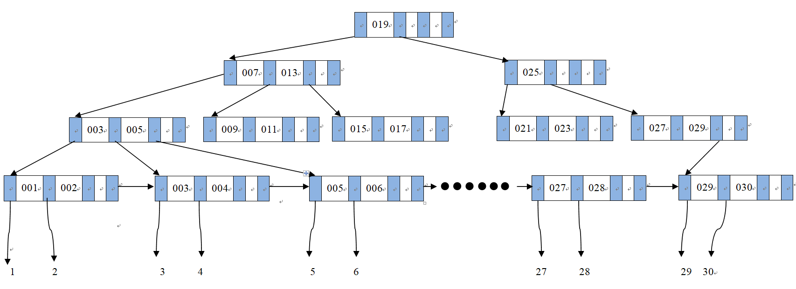

# BPlusTree
C++ implementation of B+ tree in the book **Database System Concepts** (6th edition, Abraham Silberschatz, Henyu F. Korth and S. Sudarshan)
## Introduction
The B+ tree is implemented in C++, following the pseudo-code in the book mentioned above. I've ~~carefully~~ tested it on a small scale and it works fine so far.  
## How to Run
I use **Clion** on windows 10, but basically any machine that has a C++ compiler should compile the code, so don't worry about cross-platform problems.
## Supported Operations
### Find  
Function ```find(string v)``` returns leaf node pointer ```c``` and index ```i``` such that ```c->_ptrs[i]``` points to the first record with search key ```v```. Due to B+ tree's balance property, this should run in ```O(tree height)``` time.
### Print  
Function ```printAll(string v)``` prints all records with search key ```v``` such that ```key >= v```.   
Function ```printTree()``` prints all detailed information about the tree node, for example, node type, keys, values(if it's a leaf), etc. 
### Insert  
Function ```do_insertion(string k, void *p)``` inserts pair ```(k, p)``` to the correct position. It's a complex procedure since the tree node may **split** if exceeding node capacity, meanwhile we need to take care of the node type(T_ROOT, T_INTERNAL and T_LEAF, for example), the node's type may need to be adjusted during insertion.  
### Delete  
Currently unimplemented. Sorry!  
## Limitations  
1. Up to now the key only supports **string** type.  
2. Deletion not ready.  
3. Not robust enough. If you're reading Abraham Silberschatz's book and has the curiosity to convert the pseudo-code into a real program, this repository may be a good reading material, but if you want to use the source code in your project, you're probably in the wrong place. Before I well-test the code, I do not recommend you to use it for any serious developing. But believe me, the tree will be robust in the near future.  
## Demo 
Let's take a look at how insertion works:  
First we define an array ```a```, simulatiing a table in the database:   
```int a[30] = {1, 2, 3, 4, 5, 6, 7, 8, 9, 10, 11, 12, 13, 14, 15, 16, 17, 18, 19, 20, 21, 22, 23, 24, 25, 26, 27, 28, 29, 30};```  
Next we new a b+ Tree with order 4:  
```auto tree = new BPlusTree(4);```  
Now we do 30 insertions:  
```
tree->do_insertion("001", &a[0]);
tree->do_insertion("002", &a[1]);
tree->do_insertion("003", &a[2]);
tree->do_insertion("004", &a[3]);
tree->do_insertion("005", &a[4]);
tree->do_insertion("006", &a[5]);
tree->do_insertion("007", &a[6]);
tree->do_insertion("008", &a[7]);
tree->do_insertion("009", &a[8]);
tree->do_insertion("010", &a[9]);
tree->do_insertion("011", &a[10]);
tree->do_insertion("012", &a[11]);
tree->do_insertion("013", &a[12]);
tree->do_insertion("014", &a[13]);
tree->do_insertion("015", &a[14]);
tree->do_insertion("016", &a[15]);
tree->do_insertion("017", &a[16]);
tree->do_insertion("018", &a[17]);
tree->do_insertion("019", &a[18]);
tree->do_insertion("020", &a[19]);
tree->do_insertion("021", &a[20]);
tree->do_insertion("022", &a[21]);
tree->do_insertion("023", &a[22]);
tree->do_insertion("024", &a[23]);
tree->do_insertion("025", &a[24]);
tree->do_insertion("026", &a[25]);
tree->do_insertion("027", &a[26]);
tree->do_insertion("028", &a[27]);
tree->do_insertion("029", &a[28]);
tree->do_insertion("030", &a[29]);
```   
these operations finally form such a B+ tree:   
  
in the above picture, each blue-colored grid represents a pointer field while white grid a key field. 
## License  
**All the source code is distributed under GPL license.**
